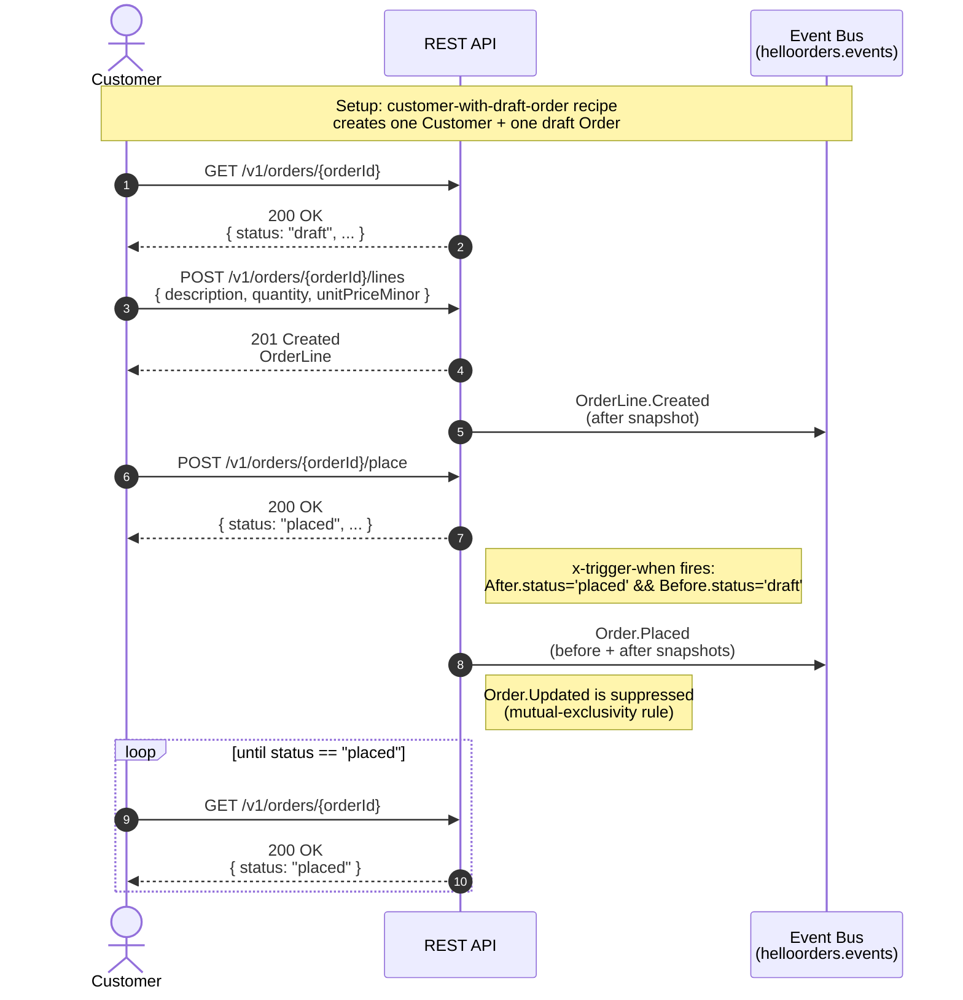

# Order domain — flow overview

The order domain in `hello-orders` covers a tiny happy path: a customer who already has a draft order adds one line item and places the order. There is no fulfillment, no payment, no refund.

## Place-order flow

The cross-domain scenario [`place-order.arazzo.yaml`](../../../specs/v1/scenarios/cross-domain/place-order.arazzo.yaml) drives this flow.

## Key contract points

- **Single state transition** in this example: `draft → placed` via `placeOrder`. The state transition is the only path that emits `Order.Placed`.
- **Mutual exclusivity** between `Order.Placed` and `Order.Updated` is enforced by the `x-trigger-when` predicate on `OrderPlaced.yaml`. When the predicate matches, `Order.Updated` is not emitted for that save.
- **OrderLine.Created** is a plain `*Created` event — after snapshot only, no state transition.
- **Polling** in step 4 is illustrative; the response from step 3 already shows `status: placed`. The poll demonstrates the async-verify pattern from the kit's `scenario-samples.yaml`.

## Out of scope

- No `cancelOrder` (no `Order.Cancelled` event).
- No fulfillment or payment events.
- No `updateOrderLine` / `removeOrderLine` operations.

When the example grows to cover more of the order lifecycle, this flow doc grows alongside.
